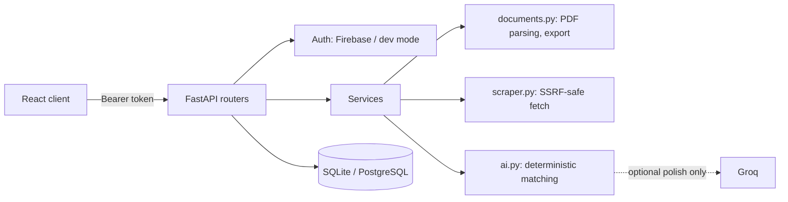

# Resume Automator API

Secure FastAPI backend for an evidence-first career workspace: resume parsing, explainable job matching, fact-locked writing assistance, application tracking, interview practice, outreach, discovery, and analytics.


[Live app](https://resume-automator-frontend.vercel.app/) · [Frontend](https://github.com/adityaguptaaaa/ResumeAutomator-Frontend) · [Roadmap](https://github.com/adityaguptaaaa/ResumeAutomator-Backend/blob/main/src/ROADMAP.md) · API docs (`/docs`)

## Why this backend is different

Resume Automator is designed around evidence instead of keyword stuffing or fabricated career claims.

- **Explainable analysis:** deterministic scores include dimensions, weights, evidence, confidence, limitations, and an input fingerprint.
- **Fact-locked assistance:** tailoring only adds claims the user explicitly confirms; optional AI polishing is constrained to the supplied draft.
- **Privacy-conscious documents:** uploaded PDFs are validated and parsed in memory rather than retained by the API.
- **Secure scraping:** job URLs are normalized and checked against private, loopback, metadata, credential-bearing, and unsupported destinations.
- **Owned workflows:** jobs, documents, applications, evidence, tasks, interviews, outreach kits, and saved searches are scoped to the authenticated user.
- **Reproducible storage:** SQLAlchemy models and Alembic migrations support SQLite locally and PostgreSQL in production.

## API surface

| Area | Representative endpoints |
| --- | --- |
| Health and operations | `/health/live`, `/health/ready`, `/metrics` |
| Resume and document workflows | `/api/v1/resumes/parse`, `/api/v1/documents`, `/api/v1/documents/export` |
| Jobs and analysis | `/api/v1/jobs`, `/api/v1/jobs/scrape`, `/api/v1/analysis`, `/api/v1/analysis/history` |
| Evidence and writing | `/api/v1/evidence`, `/api/v1/ai/tailor`, `/api/v1/ai/cover-letter` |
| Application workflow | `/api/v1/applications`, `/api/v1/tasks`, `/api/v1/outreach` |
| Interview and discovery | `/api/v1/interviews`, `/api/v1/searches`, `/api/v1/analytics/summary` |

Interactive OpenAPI and ReDoc pages are available at `/docs` and `/redoc` unless `DOCS_ENABLED=false`.

## Architecture



The analysis path stays deterministic without a `GROQ_API_KEY`. When Groq is configured, it is used only to polish an already constructed draft and cannot introduce new numeric claims.

## Local setup

Requires Python 3.12.

```bash
python -m venv .venv
# Activate the environment for your shell
python -m pip install -r requirements-dev.txt
cp .env.example .env
alembic upgrade head
uvicorn main:app --reload
```

For local development, set `APP_ENV=development` and `AUTH_MODE=development` in `.env`. Local clients can then authenticate with:

```
Authorization: Bearer dev:<uid>:<email>
```

Check the server:

```bash
curl http://127.0.0.1:8000/health/live
```

## Validation

Run the same focused checks used by CI:

```bash
python -m compileall -q app main.py
pytest --cov=app --cov-report=term-missing
alembic upgrade head
```

The GitHub Actions workflow runs compilation, tests with coverage, and a clean migration on Python 3.12 for pushes to `main` and pull requests.

## Repository map

- `app/routers/core.py`: resume, job, document, analysis, evidence, and account endpoints
- `app/routers/workflows.py`: applications, interviews, tasks, outreach, searches, and analytics
- `app/services/ai.py`: deterministic matching plus optional constrained polishing
- `app/services/documents.py`: PDF validation, parsing, and document export
- `app/services/scraper.py`: normalized public-URL fetching with SSRF defenses
- `tests/`: API, ownership, authentication, privacy, and URL-security coverage
- `alembic/versions/`: versioned database migrations

## Production boundaries

- Set `APP_ENV=production`, `AUTH_MODE=firebase`, and `FIREBASE_PROJECT_ID`.
- Configure an explicit `CORS_ORIGINS` allowlist.
- Use PostgreSQL through `DATABASE_URL`; back up the database before migrations and test restores.
- Run `alembic upgrade head` before starting the service.
- Keep `GROQ_API_KEY` server-side and disable docs with `DOCS_ENABLED=false` when appropriate.
- Tune upload, PDF-page, rate, cache, and AI-timeout limits through the documented environment variables.
- `DELETE /api/v1/account` removes the authenticated user and associated records through database cascades.

## Related repository

The React client lives in [ResumeAutomator-Frontend](https://github.com/adityaguptaaaa/ResumeAutomator-Frontend). It provides the evidence workbench, career-evidence vault, job library, application board, interview coach, outreach studio, discovery panel, and analytics dashboard.
